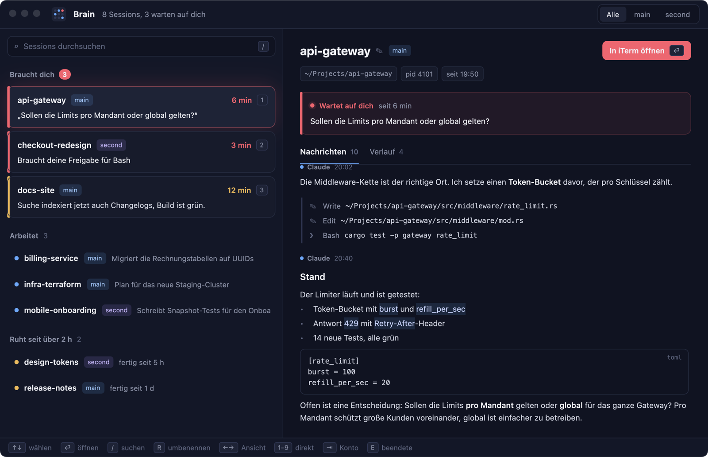

<p align="center"></p>

# Brain

A native macOS window for everyone running many [Claude Code](https://claude.com/claude-code)
sessions at once. Brain shows every session across all your Claude accounts, what each one
is doing, and above all **which ones are waiting for you**. Answer them right there, or jump
to the session's terminal with one key.

https://github.com/user-attachments/assets/dc7c6023-01a2-48a5-aaae-39ee590d54b0

*A three-minute tour of version 0.1 (German interface), narrated. Brain runs on made-up demo
sessions here.*



Built in Rust with [Iced](https://iced.rs) (native text input with dead keys and input methods,
undo, selection) and AppKit for the menu bar item, notifications and `brain://` links. The
interface follows your macOS language: English or German.

## What it does

- **Sessions run in Brain.** `⌘N` starts a session as a Claude Code background session
  (`claude --bg`) and opens it in Brain's own terminal: Claude Code exactly as in your terminal,
  in your iTerm2 font and colours, at a readable width. It keeps running when Brain quits, and
  `claude attach <id>` opens it from any terminal. `I` twice moves a session from an iTerm tab
  into Brain without losing its conversation (`/exit` there, `claude --bg --resume` here).
- **Screenshots and files in.** Drag files onto the terminal or paste a copied screenshot with
  `⌘V`: Brain inserts the path, and Claude reads the picture. `⌘`-click a path or URL in the
  output: files open in a reader beside the terminal (Markdown rendered, code highlighted,
  images shown; `⌘⏎` opens it in your editor), URLs in the browser.

- **Triage inbox.** Sessions that wait for you come first, longest wait on top: red when
  Claude asks a question or needs a permission, amber when a turn finished, quiet blue when the
  turn ended but subagents or background shells still run (from the Stop hook's
  `background_tasks`; Claude's own `brain report --waiting` still marks it red).
- **Answer from Brain.** Allow or deny an open permission prompt (`Y` / `N`), or reply to a
  session that waits for you (`T`). Brain only types when the session's state is unambiguous.
- **All accounts in one place.** `~/.claude`, `~/.claude-second` and any other
  `~/.claude-*` config dir (as used with `CLAUDE_CONFIG_DIR`) are picked up automatically.
- **Latest messages.** Your prompts, Claude's replies rendered as Markdown, tool calls as
  one-line summaries, read live from the session transcript.
- **Session details.** Model, context fill, Claude Code's own cost total and permission mode.
- **Plan usage.** Five-hour and weekly limits per account with their reset times, from the
  status line (Brain wraps your status line command and passes its output through unchanged).
- **Changes.** Branch, ahead/behind and the changed files of the session's working directory.
- **Pull requests.** The PR of each session's branch with its checks (`#12 ✓`, `#12 ✗`, `#12 …`),
  via the GitHub CLI (`gh`, logged in); click it to open the PR.
- **Conflicts.** A warning (and one notification) when two sessions edit the same files, read
  from their transcripts, and a softer hint when they change files in the same checkout.
- **Today.** What every session reported as done today, per project; copy it as Markdown.
- **Timeline.** Every hook event and report of a session.
- **The conversation reads like the terminal:** your prompts as `> …`, Claude's replies and tool
  calls with `●`, in your terminal's font (iTerm2's default profile, e.g. JetBrains Mono 13).
  `"chat_font"` and `"chat_font_size"` in `~/.claude-brain/config.json` pick another one.
- **Keep the list short.** Sessions that never got a prompt don't show up; the "resting" group
  is folded (`H`); ended sessions show for a day, older ones through the search. `⌫` twice hides
  a session until something new happens in it; `⌘⌫` twice moves an ended session's transcript to
  the **Trash**. `C` opens *Clean up*: everything ended (or in the background) and quiet for 1, 3,
  7 or 14 days, to hide or trash at once. Pinned and saved sessions always stay.
- **Claude Code's background sessions** (`claude --bg`, listed by `claude agents`) are hidden
  by default; the title bar counts them, and `B` (or a click on the count) shows them with their
  own state (blocked, failed, done …). Hidden ones don't notify. `⏎` attaches to one in a new tab, `X X` stops it,
  `⌘⌫ ⌘⌫` stops it, moves its transcript to the Trash and runs `claude rm`.
- **End now, resume later.** `X` twice ends a waiting session (`/exit`); closing the tab works
  too. Ended sessions stay in the list as long as Claude Code keeps their transcript
  (`cleanupPeriodDays`, 30 days by default), with their name, last message and how many days are
  left. `P` saves one under "Saved to resume" at the top; `⏎` resumes it in a new tab.
- **Open the terminal.** iTerm2, Terminal.app and tmux (in any terminal) jump to the exact
  pane; VS Code and Cursor bring the project window forward.
- **Search** by name, path, account or last message; **group by project** (git worktrees
  count as their main repository); **pin** and **mute** sessions.
- **Rename** a waiting session; Brain types `/rename <name>` into its terminal.
- **Menu bar count** and native **notifications** with *Open* and *Snooze 15 min*, sound only
  when a session calls you; reminders while a session keeps waiting (`remind_after_minutes`
  in `config.json`, 10 by default, 0 turns them off) and snoozing per session.
- **New sessions** in a recent folder and any account (`⌘N`), or from a **template**: a
  Markdown file with folder, account, model and a first prompt with placeholders (below).
- **Move a session to the other account** (`A` twice), e.g. when one hits its five-hour limit:
  Brain copies the transcript, resumes it there with `claude --resume <id> --fork-session` and
  closes the original.
- **Quick replies.** `T`, then `1`–`9` sends a canned reply; set your own with
  `"quick_replies": ["…", "…"]` in `~/.claude-brain/config.json`.
- **English or German**, following your macOS language (override with `BRAIN_LANG=de|en` or
  `{"language": "de"}` in `~/.claude-brain/config.json`).

## How sessions report

Every session appends JSON lines to `~/.claude-brain/events/YYYY-MM-DD.jsonl`, from two
sources:

- **Hooks** (automatic): `SessionStart`, `UserPromptSubmit`, `Notification`, `Stop` and
  `SessionEnd` call `brain hook`.
- **Reports** (written by Claude, instructed via `CLAUDE.md`):
  `brain report --doing|--waiting|--done "<one line>"`.

Without hooks Brain still shows a coarse state from Claude Code's own
`<config>/sessions/<pid>.json` files.

## Install

Requirements: macOS 13+ (Apple Silicon for the release builds).

### With Homebrew

```sh
brew tap martinemmert/big-brain-claude https://github.com/martinemmert/big-brain-claude
brew install --cask brain
brain install
```

The cask installs `Brain.app` and links the `brain` CLI that ships inside it. The app is
only ad-hoc signed, not notarized, so macOS blocks the first start: System Settings →
Privacy & Security → Open Anyway, or `xattr -dr com.apple.quarantine /Applications/Brain.app`.
`brain install` (once) adds the hooks, see [From source](#from-source).

### From a release

Download `Brain-<version>-macos-arm64.zip` and `brain-<version>-macos-arm64.tar.gz`
(Apple Silicon) from [Releases](https://github.com/martinemmert/big-brain-claude/releases).

1. Unzip and move `Brain.app` to `/Applications`. The app is only ad-hoc signed, not
   notarized, so macOS blocks the first start: right-click → Open (macOS 15: System
   Settings → Privacy & Security → Open Anyway), or run
   `xattr -dr com.apple.quarantine /Applications/Brain.app`.
2. Put `brain` on your `PATH` and run `brain install`. The hooks call `brain` at the path it
   was installed from, so move it first:

   ```sh
   tar -xzf brain-*-macos-arm64.tar.gz
   sudo mv brain /usr/local/bin/   # or any other directory on your PATH
   brain install
   ```

   If macOS refuses to run it, `xattr -d com.apple.quarantine /usr/local/bin/brain`.

### From source

Requires a recent stable Rust toolchain.

```sh
git clone https://github.com/martinemmert/big-brain-claude.git
cd big-brain-claude
./scripts/install.sh
```

This

- builds `dist/Brain.app` and `dist/brain` with `scripts/bundle.sh`,
- installs the `brain` CLI to `~/.cargo/bin`,
- installs `~/Applications/Brain.app` (open it via Spotlight),
- runs `brain install`, which adds Brain's hooks, a `Bash(brain report:*)` permission and a
  short protocol section to the `settings.json` and `CLAUDE.md` of every `~/.claude*`
  account. Existing files are backed up as `*.brain-backup-<timestamp>`; running it again
  is safe.

Running sessions pick up the hooks on their own.

### Alfred

Download `Brain.alfredworkflow` from the
[latest release](https://github.com/martinemmert/big-brain-claude/releases/latest) and
double-click it. Type `cc` and part of a session's name, path or latest message:

- `⏎` brings the session's terminal to the front (`brain open <account>:<pid>`),
- `⌥⏎` shows it in Brain (`brain show <account>:<pid>`).

The workflow finds `brain` in `/opt/homebrew/bin`, `/usr/local/bin` or `~/.cargo/bin`.
Sessions are listed in Brain's order: needs you, your turn, working.

## Uninstall

```sh
brain uninstall
```

This removes Brain's hooks, the `Bash(brain report:*)` rule and the protocol section from
the `settings.json` and `CLAUDE.md` of every `~/.claude*` account, with backups as above.
Then delete `Brain.app`, the `brain` binary (`~/.cargo/bin/brain` or wherever you put it)
and `~/.claude-brain`. With Homebrew: `brew uninstall --zap --cask brain` removes all three.

## Keys

| Key | Action |
|---|---|
| `↑` `↓` / `j` `k` | select |
| `⏎`, double-click | open the session: in Brain's terminal if it runs in Brain, else its terminal app (an ended one resumes) |
| `⌥⏎` | open it in iTerm instead |
| `⌘J` / `⌘[` | keyboard into the terminal / back to the list |
| `I` `I` | move a session from its iTerm tab into Brain |
| `⌘`-click | open a path (reader) or URL from the terminal output |
| `1`–`9` | open the n-th session |
| `Y` / `N` | allow / deny an open permission prompt |
| `T` | reply to a session that waits for you (then `1`–`9` for a quick reply) |
| `R`, click the name | rename (only while the session waits for you) |
| `/`, `⌘F` | search (`esc` clears) |
| `P` / `M` | pin (an ended session: save it to resume) / mute notifications |
| `S` | snooze: 15 min → 1 h → until tomorrow 9:00 → off |
| `G` / `D` | group by project / today's digest (`⌘C` copies it) |
| `X` `X` | end the session (`/exit`; a background session: `claude stop`); it stays resumable |
| `⌫` `⌫` | hide the session until something new happens in it (again: show it) |
| `⌘⌫` `⌘⌫` | move an ended session's transcript to the Trash |
| `C` | clean up: hide or trash everything quiet for N days |
| `H` | fold / unfold the resting group |
| `B` | show / hide Claude Code's background sessions |
| `A` `A` | move the session to the next account (an ended one resumes there) |
| `⌘N` | start a new session (in Brain; `⌘I` in the dialog: in iTerm) |
| `←` `→` | switch between messages, timeline, changes and terminal |
| `⇥` | cycle the account filter |
| `E` | show ended sessions |

`brain status` prints the board in the terminal; `brain sessions --json` lists the open
sessions for scripts (account, pid, name, phase, headline, cwd).

## Templates

Templates live in `~/.claude-brain/templates/*.md` and are edited in your own editor
(`⌘E` in the `⌘N` dialog opens the selected one, `⌘⇧N` creates a new one):

```markdown
---
name: Review a merge request
folder: ~/Work/app
account: main
model: haiku
---
Review the merge request for {branch} and list blocking issues first.
```

Every header line is optional. Brain asks for each `{placeholder}` and, if the template has no
`folder`, for the folder, then starts `claude --model … '<prompt>'` in a new terminal tab.

## Develop

```sh
cargo test -p brain-core              # protocol, state, transcript and Markdown logic
cargo run -p brain-app                # the app against your real sessions
BRAIN_DEMO=1 cargo run -p brain-app   # made-up sessions, e.g. for screenshots
./scripts/make-icns.sh                # re-render the icon
./scripts/bundle.sh                   # release build into dist/ (ad-hoc signed Brain.app, brain,
                                      # Brain.alfredworkflow)
```

Pushing a `v*` tag that matches the version in `Cargo.toml` builds a GitHub release with
the zipped app, the `brain` binary, the Alfred workflow and SHA-256 checksums, then points
`Casks/brain.rb` at it (a commit to `main`).

- `crates/brain-core`: event protocol, store, accounts, session discovery, state reducer,
  transcript and Markdown readers
- `crates/brain-terminal`: terminal adapters (iTerm2, Terminal.app, tmux, VS Code, Cursor)
- `crates/brain-cli`: the `brain` binary (`hook`, `report`, `install`, `uninstall`, `status`,
  `sessions`, `open`, `show`)
- `crates/brain-app`: the Iced app
- `crates/iced-term`: Brain's fork of [iced_term](https://github.com/Harzu/iced_term) (MIT,
  Ilya Shvyryalkin): Ctrl keys, ⇧⏎ and back-tab for Claude Code, clickable file paths, plain
  look-alikes for glyphs that would fall back to colour emoji

Design notes: [`docs/superpowers/specs/2026-10-02-claude-brain-design.md`](docs/superpowers/specs/2026-10-02-claude-brain-design.md)

## License

[MIT](LICENSE)
